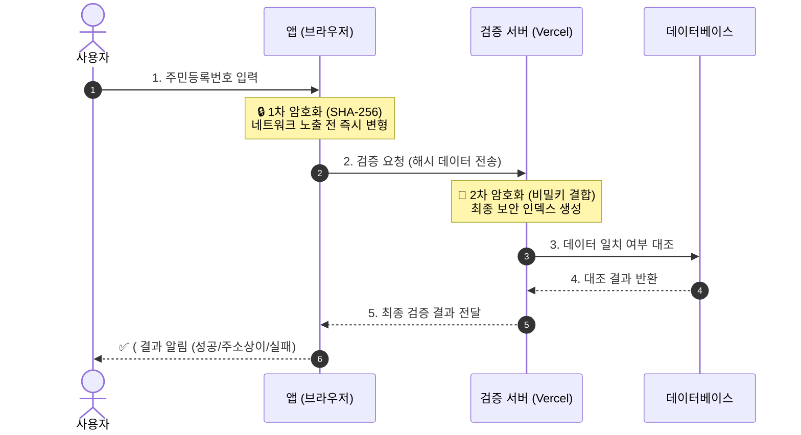
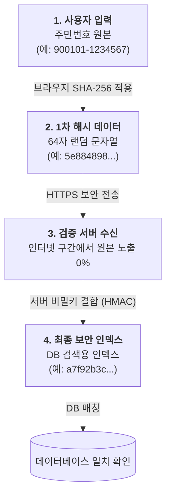

# 주민등록번호 보안 강화 기술 명세 (Double Hashing)

본 문서는 HWPX 스마트 편집기 시스템에서 주민등록번호(SSN)의 유출을 원천 차단하기 위해 도입된 **이중 해싱(Double Hashing)** 구조를 설명합니다.

## 1. 개요 (Background)

단일 해싱 방식은 네트워크 전송 과정에서 주민번호 원본이 노출될 위험이 있으며, 브라우저의 개발자 도구(Network 탭)를 통해 실시간으로 정보를 가로챌 수 있습니다. 이를 방지하기 위해 **클라이언트와 서버가 역할을 나누어 두 번 해싱**하는 구조를 채택합니다.

## 2. 보안 검증 프로세스 (Architecture)

사용자 입력부터 최종 결과 확인까지의 전체 과정을 요약한 아키텍처입니다.

## 3. 데이터 변환 단계 흐름

데이터가 각 계층을 통과하며 어떻게 변하는지 보여주는 간략한 흐름도입니다.

## 4. 단계별 세부 로직

### Phase 1: Client-side Hashing (Frontend)

- **알고리즘**: SHA-256
- **목적**: 네트워크 전송 시 주민번호 원본 노출 방지
- **특징**: 브라우저에서 즉시 해싱되어 암호화된 문자열 형태로 전송됩니다.

### Phase 2: Server-side Hashing (Backend)

- **알고리즘**: HMAC-SHA256 (Keyed-Hash)
- **목적**: Blind Index 생성 및 무차별 대입 공격(Brute-force) 방지
- **특징**: 서버만 알고 있는 `DB_ENCRYPTION_KEY`를 결합하여 해싱합니다. DB가 유출되더라도 서버 비밀키 없이는 원본 유추가 불가능합니다.

## 4. 기대 효과 (Benefits)

1. **네트워크 무결성**: 통신 구간에서 주민번호 원본이 단 한 번도 흐르지 않습니다.
2. **개인정보 보호**: 브라우저 메모리나 로그에 주민번호가 남지 않습니다.
3. **DB 보안**: DB에는 최종 결과물인 `ssn_hash_v2`만 인덱스로 저장되므로, 데이터베이스가 유출되어도 실제 주민번호를 복원할 수 없습니다.
4. **성능 유지**: 복호화 없이 해시값 비교만 수행하므로 검색 성능이 저하되지 않습니다.

---
*본 문서는 기술적 검토 및 보안 가이드라인으로 활용됩니다.*
