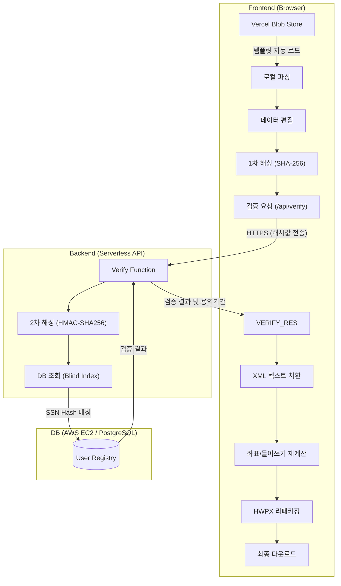

# HWPX 스마트 편집기 (해촉증명서)

Regex 기반 로컬 파싱을 통해 HWPX 문서를 분석하고, PostgreSQL 데이터베이스와 연동하여 실시간 검증을 제공하는 문서 편집 도구입니다.

## 🚀 주요 기능

### 1. Frontend (Client-side)

- **✨ 템플릿 기반 자동 워크플로우**: 앱 시작 시 표준 템플릿을 자동으로 로드하여 즉시 편집 가능한 상태로 전환합니다.
- **⚡ HWPX 로컬 파싱**: Regex 기반 XML 파싱으로 외부 API 호출 없이 브라우저에서 즉시 데이터를 추출합니다.
- **🏗️ Advanced 레이아웃 엔진**:
  - **Hanging Indent**: 긴 주소 텍스트에 대해 자동으로 들여쓰기 좌표를 계산하여 가독성을 높입니다.
  - **Dynamic Shifting**: 내용이 길어질 경우 하단 단락들을 자동으로 밀어내어 겹침을 방지합니다.
- **🗓️ 스마트 기간 산출**:
  - **자동 계산 로직**: 사용자가 연/월 범위만 선택하면, DB의 지급일 데이터를 기반으로 실제 용역 기간(최초 시작일 ~ 최종 종료일)을 자동으로 산출합니다. (로직: 용역월 = 지급월 - 1개월)
  - **Custom UI**: 연도/월 선택을 위한 직관적인 커스텀 셀렉트 박스를 적용하여 사용성을 개선했습니다.
- **🧾 검증 UX 고도화**:
  - **직관적 모달**: 주소 정보와 지급 내역을 섹션별로 분리하여 가독성을 높였습니다.
  - **지급 내역 제공**: 주소가 다르더라도 실제 지급된 날짜 리스트를 제공하여 본인 확인을 돕습니다.
- **🏢 용도(Purpose) 필드 개선**:
  - **드롭다운 UI**: '국민건강보험공단' 등 제출 기관을 간편하게 선택할 수 있습니다.
  - **자동 후처리**: 화면에서는 기관명만 선택하지만, 다운로드 시 'OOO 제출' 텍스트가 자동으로 붙습니다.
  - **필수 입력 검증**: 용도 미선택 시 명확한 경고 메시지와 배지(Badge)를 표시하여 누락을 방지합니다.
- **🎨 UI/UX Refinement**:
  - **입력 폼 최적화**: '증명서 발급일' 등 자동 설정되는 항목을 입력창에서 제거하여 편집 집중도를 높였습니다.
  - **시각적 가이드 강화**: '자동 설정', '필수 선택' 등의 직관적인 배지(Badge)를 도입하여 사용자가 입력 상태를 명확히 인지하도록 개선했습니다.
  - **초기화 로직 개선**: '초기화' 버튼 클릭 시 발급일이 과거(템플릿 날짜)로 돌아가는 버그를 수정하여 오늘 날짜가 안정적으로 유지됩니다.
  - **버튼 최적화**: '초기화' 버튼에 고급스러운 버건디(Rose) 컬러를 적용하고, 주요 버튼과의 크기 밸런스를 조정했습니다.
  - **사용자 가이드**: 폼 하단에 편집-검토-다운로드 흐름을 안내하는 가독성 높은 리스트 UI를 추가했습니다.
- **📂 직관적인 파일명**: 다운로드 시 `신청인성함_건강보험공단제출용해촉증명서.hwpx` 형식으로 자동 생성됩니다.

### 2. Backend & Security (Server-side)

- **☁️ Serverless Architecture**: Vercel Serverless Function을 통해 별도의 서버 호스팅 없이 백엔드 로직을 처리합니다.
- **🛡️ 강력한 데이터 보안**:
  - **Vercel Blob Storage**: 템플릿 파일을 Git 저장소가 아닌 보안 클라우드 스토리지([Vercel Blob](https://vercel.com/docs/storage/vercel-blob))에 보관하여 원본 유출 및 관리 리스크를 최소화했습니다.
  - **SSN 암호화**: 주민등록번호 원본은 `pgcrypto` AES-256 방식으로 암호화되어 DB(AWS EC2)에 안전하게 저장됩니다.
  - **Blind Index Searching**: 검색 시에는 복호화 없이 `HMAC-SHA256` 해시값만을 사용하여 매칭하므로, 보안성과 성능을 동시에 확보합니다.
  - **이중 해싱 (Double Hashing)**: 클라이언트 SHA-256 + 서버 HMAC-SHA256 구조로 네트워크 구간에서 원본 주민번호가 노출되지 않도록 보안을 강화했습니다.
- **🔒 원본 무결성**: OCF 표준 준수 및 XML 속성 보호를 통해 파일 손상 없이 원본 서식을 완벽하게 유지합니다.

### 📄 템플릿 관리 (Template Management)

본 시스템은 보안을 위해 `public` 폴더에 템플릿 파일을 두지 않고 클라우드에서 직접 로드합니다.

- **저장소**: Vercel Blob Storage
- **갱신 방법**:
  1. 신규 `.hwpx` 템플릿을 Vercel 대시보드의 Storage 탭에서 업로드
  2. 생성된 새로운 URL을 `src/hooks/useTemplateLoader.ts` 내의 `fetch` 주소에 반영
- **장점**: Git 저장소에 민감한 양식이 포함되지 않아 보안성이 높고, 배포 없이도 템플릿 교체가 가능합니다.

## 📋 시스템 아키텍처



## 🔐 보안 아키텍처 (Security Architecture)

본 시스템은 다층 보안 구조를 통해 민감한 개인정보(주민등록번호)를 보호합니다.

### 이중 해싱 (Double Hashing)

1. **클라이언트 (1차)**: 브라우저에서 SHA-256 해싱 → 네트워크 전송 시 원본 노출 차단
2. **서버 (2차)**: HMAC-SHA256 + 비밀키 → DB 검색용 Blind Index 생성
3. **효과**: 네트워크 패킷 캡처, DB 유출 시에도 원본 복원 불가능

### 데이터 암호화

- **저장**: 주민번호 원본은 AES-256 (`pgcrypto`)으로 암호화되어 DB에 저장
- **검색**: 복호화 없이 해시 인덱스만으로 매칭 수행 (성능 + 보안)

> [!TIP]
> 이중 해싱의 상세 원리와 데이터 흐름도는 [보안 기술 명세서](./README(security).md)를 참고하세요.

## 🗄️ 데이터베이스 구조

### `hwpx_01.user_registry` (메인 테이블)

해촉증명서 발급 대상자의 기본 정보와 암호화된 개인정보를 관리합니다.

| 컬럼명 | 타입 | 설명 | 보안/특이사항 |
| :--- | :--- | :--- | :--- |
| `id` | SERIAL | 고유 식별자 | PRIMARY KEY |
| `manager` | TEXT | 담당자 | |
| `payment_date` | DATE | 지급년월일 | **용역 기간 산출 기준** (용역월 = 지급월 - 1개월) |
| `registrant_name` | TEXT | 신고소득자명 | **Index** (조회용) |
| **`ssn`** | **BYTEA** | 주민등록번호 | **AES-256 암호화** 저장 (`pgcrypto`) |
| **`ssn_hash`** | **TEXT** | 주민번호 해시 | **Blind Index** (이중 해싱: SHA-256 → HMAC-SHA256), **Index** |
| `contact` | TEXT | 연락처 | |
| `address` | TEXT | 거주주소 | |
| `promotion_name` | TEXT | 프로모션명 | |
| `blog_url` | TEXT | 블로그 URL | |
| `instagram_url` | TEXT | 인스타 URL | |
| `created_at` | TIMESTAMPTZ | 데이터 생성일 | DEFAULT NOW() |
| `updated_at` | TIMESTAMPTZ | 데이터 수정일 | DEFAULT NOW() |

> [!NOTE]
> 주민등록번호 원본(`ssn`)은 직접 조회하지 않으며, 검증 시에는 검색 인덱싱된 `ssn_hash`값과 사용자 이름(`registrant_name`)을 결합하여 매칭합니다.

## 📂 프로젝트 구조

```text
hwpx-back/
├── src/                       # 프론트엔드 소스 코드 (모듈화된 구조)
│   ├── components/
│   │   ├── forms/             # 폼 관련 컴포넌트
│   │   │   └── EditorForm.tsx # 좌측 입력 폼 패널
│   │   ├── preview/           # 미리보기 관련 컴포넌트
│   │   │   └── DocumentPreview.tsx # 우측 A4 미리보기 패널
│   │   └── ui/                # 재사용 가능한 UI 컴포넌트
│   │       ├── Card.tsx       # 카드 레이아웃
│   │       ├── SectionHeader.tsx  # 섹션 헤더
│   │       ├── Button.tsx     # 커스텀 버튼
│   │       ├── Modal.tsx      # 커스텀 모달 (성공/에러/경고)
│   │       └── CustomSelect.tsx # 커스텀 셀렉트 (Search/Scroll 용이)
│   ├── hooks/                 # 커스텀 React 훅
│   │   ├── useModal.ts        # 모달 상태 관리
│   │   ├── useTemplateLoader.ts # 템플릿 자동 로딩 및 파싱
│   │   └── useFileUpload.ts   # [DEPRECATED] 파일 업로드 (참조용 유지)
│   └── utils/                 # 유틸리티 함수
│       ├── crypto.ts          # SHA-256 해싱
│       ├── date.ts            # 날짜 관련 유틸 (KST 변환 등)
│       ├── xml.ts             # XML 텍스트 치환
│       └── hwpx/
│           └── layout.ts      # 레이아웃 계산 (문자 가중치, 상수)
├── api/
│   └── verify.ts              # Vercel Serverless Function (DB 검증 로직)
├── services/
│   └── localParserService.ts  # HWPX 파싱 엔진 (Regex 기반)
├── db_data/                   # DB 마이그레이션 스크립트 및 문서
├── App.tsx                    # 메인 애플리케이션 (상태 관리 및 레이아웃 조정)
├── types.ts                   # TypeScript 타입 정의
└── README.md                  # 프로젝트 문서
```

## ⚙️ 시작하기

### 1. 요구 사항

- **Node.js**: v18 이상 권장
- **Vercel CLI**: 서버리스 함수 및 로컬 환경 구동을 위해 필수
- **PostgreSQL**: 데이터 저장을 위한 DB 환경 (현재 AWS EC2에 구성됨)

### 2. 환경 및 의존성 설정

먼저 프로젝트를 로컬로 가져온 후 필요한 패키지를 설치하고, Vercel 계정 인증을 진행합니다.

```bash
# 1. 의존성 설치 (프로젝트 루트에서 실행)
npm install

# 2. Vercel CLI 전역 설치 (미설치 시)
npm install -g vercel

# 3. Vercel 계정 로그인 (로그인이 안 되어 있는 경우)
vercel login
```

### 3. 프로젝트 연결 및 환경 변수 동기화

로컬 환경에서 DB API를 호출하기 위해 Vercel 프로젝트와 연동하고 저장된 환경 변수를 가져옵니다.

```bash
# 4. Vercel 프로젝트 연결
# (최초 실행 시 'Set up and deploy?' 질문에 'Y' 후 기존 프로젝트 이름 선택)
vercel link

# 5. 환경 변수 동기화 (.env.local 생성)
vercel env pull .env.local
```

### 4. 로컬 실행

**API와 프론트엔드를 동시에 구동하려면 반드시 `vercel dev`를 사용해야 합니다.**

```bash
# 로컬 개발 서버 실행 (localhost:3000)
vercel dev
```

> **Note**: `npm run dev`는 프론트엔드 전용 서버이므로 `/api/verify` 호출 시 에러가 발생합니다. 반드시 Vercel CLI가 로컬 런타임을 에뮬레이션하는 `vercel dev`를 사용해 주세요.

## 🔑 환경 변수 목록

Vercel 대시보드(Environment Variables) 혹은 `.env` 파일에 기록되어야 하는 핵심 변수입니다:

- `DATABASE_URL`: PostgreSQL 인스턴스 접속 주소
- `DB_ENCRYPTION_KEY`: DB 데이터 암호화 및 해싱용 32자 비밀키

## ⚠️ 참고 사항

- 본 도구는 표준 HWPX 파일만 지원합니다. (.hwp 파일은 변환 후 사용)
- 로컬 개발 환경(`vercel dev`)에서는 DB 접속 시 네트워크 지연이 발생할 수 있으나, 배포 환경에서는 초고속으로 동작합니다.
